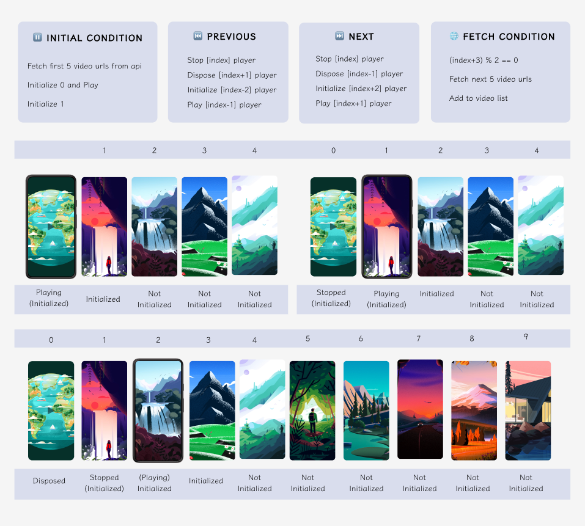

[](https://pub.dev/packages/fancy_text_reveal)  


# Flutter Preload Videos from API


### Introduction 🚀

> Preloading logic to reduce video initialization using isolate to fetch videos in the background so that the video experience is not disturbed.

> Without the use of isolate, the video will be paused whenever there is an API call because the main thread will be busy fetching new video URLs.

> More about isolate: 🌐 https://blog.codemagic.io/understanding-flutter-isolates/

### Demo 👀


### Logic 🎯




### Usage 🎨

To clone and run this application, you'll need [git](https://git-scm.com) and [flutter](https://flutter.dev/docs/get-started/install) installed on your computer. From your command line:

```bash
# Clone this repository
$ git clone https://github.com/Shadow60539/flutter_preload_videos.git

# Go into the repository
$ cd flutter_preload_videos

# Install dependencies
$ flutter packages get

# Run the app
$ flutter run
```


### Packages 📦


Package | Description
---|---
[video_player](https://pub.flutter-io.cn/packages/video_player) | Render videos in Flutter
[build_runner](https://pub.flutter-io.cn/packages/build_runner) | Build Custom Models
[flutter_bloc](https://pub.flutter-io.cn/packages/flutter_bloc) | BLoC State Management
[freezed](https://pub.flutter-io.cn/packages/freezed) | Code generation for immutable classes

### Directory Structure 🏢

The project directory structure is as follows:

```
├── android
├── asset
├── build
├── images
├── ios
├── lib
├── test
├── analysis_options.yaml
├── pubspec.lock
├── pubspec.yaml

```
